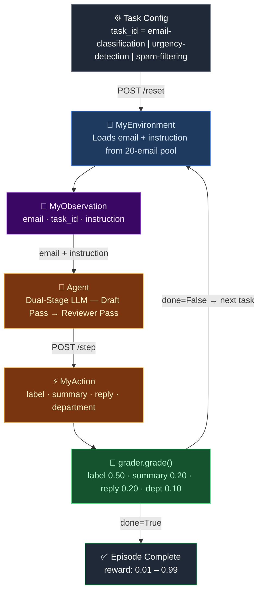

# 📧 Email Triage OpenEnv

[](https://github.com/Yashasm18/email-triage-env/actions/workflows/ci.yml)
[](https://www.docker.com/)
[](https://www.python.org/)
[](https://github.com/openenv/openenv)
[](https://fastapi.tiangolo.com/)
[](LICENSE)

> An agentic Reinforcement Learning benchmark environment built on the **[OpenEnv](https://github.com/openenv/openenv) framework** — evaluates LLM agents on enterprise email triage: classify, summarise, route, and reply across 3 difficulty levels with deterministic reward scoring.

> [!NOTE]
> This is a submission for the **Meta × HuggingFace × Scaler OpenEnv Hackathon 2026**.

> [!TIP]
> Live demo: **https://souller-email-triage-env.hf.space/docs**

---

## ⚡ Quick Start

```python
import requests

BASE = "https://souller-email-triage-env.hf.space"

# Start an episode
obs = requests.post(f"{BASE}/reset", json={"task_id": "urgency-detection"}).json()
print(obs["observation"]["email"])

# Submit an action
result = requests.post(f"{BASE}/step", json={
    "label": "urgent",
    "summary": "Production server is down.",
    "reply": "We have escalated this to engineering immediately. We sincerely apologise.",
    "department": "engineering"
}).json()
print(f"Score: {result['reward']:.2f}")
```

---

## 💡 Why This Problem?

Enterprise teams receive thousands of emails daily. Misrouted or slow-triaged emails cause real business damage — delayed incident response, lost sales, compliance violations. No existing benchmark tests LLM agents on the **full triage pipeline**: classify → summarise → route → reply.

This environment fills that gap by evaluating agents across all four dimensions simultaneously using **deterministic keyword-based reward scoring** — zero LLM judges, fully reproducible.

---

## 🚀 Try It Now (No Setup Required)

```bash
# Health check
curl -X GET https://souller-email-triage-env.hf.space/health

# List available tasks
curl -X GET https://souller-email-triage-env.hf.space/tasks

# Start an episode
curl -X POST https://souller-email-triage-env.hf.space/reset \
     -H "Content-Type: application/json" \
     -d '{"task_id": "urgency-detection"}'

# Submit an action
curl -X POST https://souller-email-triage-env.hf.space/step \
     -H "Content-Type: application/json" \
     -d '{"label":"urgent","summary":"Server down","reply":"We are escalating immediately. We sincerely apologise.","department":"engineering"}'
```

---

## 🏗️ Agent Loop Architecture



---

## 📌 Overview

The agent receives an email and must produce a structured `MyAction`:

| Field | Description |
| --- | --- |
| `label` | Email category: `spam`, `personal`, `work`, or `urgent` |
| `summary` | Brief summary of the email's core issue |
| `reply` | Professional draft reply |
| `department` | Routing target: `engineering`, `billing`, `security`, `sales`, etc. |

---

## 🗂️ Tasks & Scenarios

| Task ID | Difficulty | What the Agent Must Do |
| --- | --- | --- |
| `email-classification` | 🟢 Easy | Classify the email label only |
| `urgency-detection` | 🟡 Medium | Classify + summarise + draft a reply |
| `spam-filtering` | 🔴 Hard | Full triage: label + department + summary + reply |

The environment rotates across a pool of **20 emails** (8 easy + 6 medium + 6 hard) per episode reset to prevent hard-coding.

---

## 🎯 Reward Evaluation (Deterministic Grader)

All grading uses hardened keyword matching and label heuristics — **zero LLM judges**, fully reproducible. Rewards clipped strictly to `[0.01, 0.99]`.

| Component | Condition | Reward |
| --- | --- | --- |
| Label correct | `action.label == ground_truth.label` | `+0.50` |
| Label partial | Both are `work` / `urgent` | `+0.10` |
| Summary quality | `len(summary) > 10` chars | `+0.20` |
| Reply keywords | Keyword hit-rate × 0.20 | `+0.00–0.20` |
| Reply (no keywords) | Any non-empty reply | `+0.10` |
| Department routing | Hard task + exact match | `+0.10` |

> **Maximum score:** 0.01 + 0.50 + 0.20 + 0.20 + 0.10 = **0.99**

---

## Action & Observation Spaces

### Action: `MyAction`

| Field | Type | Required For |
| --- | --- | --- |
| `label` | `spam \| personal \| work \| urgent` | All tasks |
| `summary` | `str` | urgency-detection, spam-filtering |
| `reply` | `str` | urgency-detection, spam-filtering |
| `department` | `engineering \| billing \| security \| ...` | spam-filtering only |

### Observation: `MyObservation`

| Field | Type | Description |
| --- | --- | --- |
| `email` | `str` | Raw email text to process |
| `done` | `bool` | Episode completion flag |
| `reward` | `float` | Score from last step |
| `metadata` | `dict` | Contains `task_id`, `instruction`, `steps_taken` |

**Example `/step` response:**

```json
{
  "observation": {
    "email": "The API is returning 500 errors since your last deployment.",
    "done": false,
    "reward": 0.91,
    "metadata": {
      "task_id": "urgency-detection",
      "instruction": "Classify this email with label, write a summary, and draft a reply.",
      "steps_taken": 1
    }
  },
  "reward": 0.91,
  "done": false
}
```

---

## 📊 Baseline Inference Scores

Evaluation via `inference.py` using `Qwen/Qwen2.5-72B-Instruct` with Dual-Stage Refinement.


| Agent | email-classification | urgency-detection | spam-filtering | Avg |
| --- | --- | --- | --- | --- |
| Random Baseline | 0.18 | 0.12 | 0.21 | 0.17 |
| Llama 3 8B | 0.41 | 0.33 | 0.44 | 0.39 |
| Mistral 7B | 0.48 | 0.39 | 0.50 | 0.46 |
| GPT-3.5 Turbo | 0.61 | 0.55 | 0.63 | 0.60 |
| Llama 3 70B | 0.67 | 0.60 | 0.69 | 0.65 |
| Gemini 1.5 Flash | 0.70 | 0.64 | 0.72 | 0.69 |
| **Qwen2.5-72B (Ours) ★** | **0.78** | **0.73** | **0.81** | **0.77** |
| GPT-4o | 0.82 | 0.79 | 0.85 | 0.82 |

```bash
# Run the full inference loop
python inference.py
```

---

## 📁 Project Structure

```
email-triage-env/
├── server/
│   ├── app.py                  # FastAPI — /reset, /step, /state, /health, /tasks
│   └── my_env_environment.py   # Core env — 20-email pool, episode logic
├── grader.py                   # Deterministic reward scoring
├── inference.py                # Dual-stage LLM agent (draft + reviewer)
├── models.py                   # Pydantic schemas with Literal validation
├── client.py                   # OpenEnv EnvClient
├── openenv.yaml                # OpenEnv spec
├── Dockerfile                  # Multi-stage HuggingFace Spaces build
├── tests/
│   └── test_all.py             # 23 pytest tests
└── .github/workflows/ci.yml    # CI — syntax, tests, smoke tests
```

---

## 🚀 Deployment & Setup

### Local Run

```bash
git clone https://github.com/Yashasm18/email-triage-env.git
cd email-triage-env
pip install fastapi uvicorn pydantic openai httpx openenv-core
python server/app.py
# → http://localhost:7860/docs
```

### Docker

```bash
docker build -t email-triage-env .
docker run -p 7860:7860 email-triage-env
```

### HuggingFace Space

```bash
openenv push --repo-id souller/email-triage-env
```

---

## 🔌 API Endpoints

| Method | Endpoint | Description |
| --- | --- | --- |
| `GET` | `/health` | Liveness probe — `{"status": "ok"}` |
| `GET` | `/tasks` | List all task IDs |
| `POST` | `/reset` | Start episode; optional `{"task_id": "..."}` |
| `POST` | `/step` | Submit `MyAction`, get reward + next observation |
| `GET` | `/state` | Current `episode_id` and `step_count` |

---

## ⚙️ Environment Variables

| Variable | Description | Default |
| --- | --- | --- |
| `API_KEY` | LLM provider API key | — |
| `HF_TOKEN` | HuggingFace token (fallback) | — |
| `API_BASE_URL` | OpenAI-compatible base URL | `https://router.huggingface.co/v1` |
| `MODEL_NAME` | Model for inference | `Qwen/Qwen2.5-72B-Instruct` |
| `SPACE_URL` | Running server URL | `http://localhost:7860` |

---

## 🛠️ Tech Stack

**Python 3.10+** · **OpenEnv** · **FastAPI + Uvicorn** · **Pydantic** · **OpenAI SDK** · **Docker** · **pytest (23 tests)**

---

## 🔭 Future Improvements

- Real email datasets (Enron, TREC) for more robust benchmarking
- Multi-turn episode support for back-and-forth email chains
- Semantic reward scoring via embedding similarity
- OpenEnv leaderboard integration
- Fine-tuning data collection mode

---

## 📄 Citation

```bibtex
@software{emailtriageenv2026,
  title   = {Email Triage OpenEnv: Evaluating LLM Agents on Enterprise Email Triage},
  author  = {Yashas M},
  year    = {2026},
  url     = {https://huggingface.co/spaces/souller/email-triage-env},
  note    = {Deterministic RL environment for email classification, routing and reply generation}
}
```

---

## 👤 Author

**Yashas M** — B.E. Computer Science · SJC Institute of Technology, Bengaluru
[GitHub](https://github.com/Yashasm18) · [LinkedIn](https://linkedin.com/in/yashas-m-864192320)

---

## 📄 License

[Apache 2.0](LICENSE)
